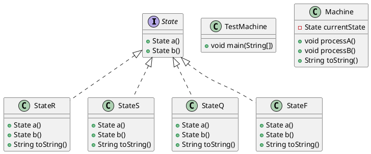
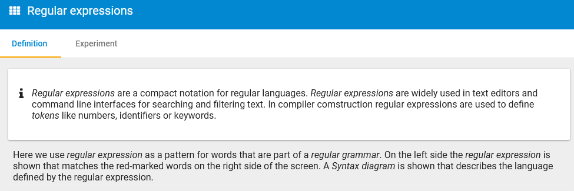

# Automata & Programming 2023.1

Repository van Simon Zweers IT102

Link naar de verslagen van elke week:

* [Week 1 uitwerking](./src/week1)
* [Week 2 uitwerking](./src/week2)
* [Week 4 uitwerking](./src/week4)
* [Week 5 uitwerking](./src/week5)

[Doe een markdown tutorial!](https://www.markdowntutorial.com)

Zet je naam & groep in dit document en al je broncode voor de opdrachten per week.

Gebruik ook plaatjes en UML-diagrammen als toelichting.

Voorbeeld UML klassen diagram met interface:



Nog een voorbeeld plaatje
```plantuml
hide empty description
note "dit is een voorbeeld plantUML state diagram\nzie week 1" as N1
[*] -> Q0
Q3 -> [*]
Q0 -> Q0 : a,c
Q0 --> Q1 : b
Q1 -> Q1 : b
Q1 --> Q2 : a
Q2 -> Q3 : c
Q2 -> Q1 : b
Q2 -> Q0 :a
Q3 -> Q1 : b
Q3 -> Q0 : a
note left of Q2 : voorbeeld. Je kan ook Flaci screenshots linken
```
Screenshots kun je copy+paste plaatsen vanuit intellij, bijvoorbeeld uit FLACI.COM.

De IDE maakt er een png plaatje van dat je ook kunt committen naar je repo. Eventueel de map wijzigen.

