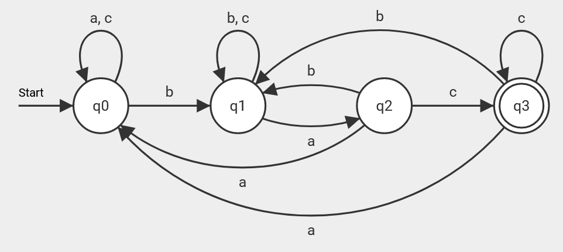
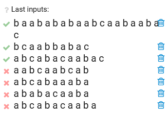

# Week 1

Simon Zweers, IT102

Voor de practicumopgaven van week 1 moesten we een aantal dingen doen:

Een van de opgaven was om een automaat te maken in FLACI voor de FSAexec klasse:



Om te testen heb ik 4 extra inputs aan de automaat gegeven:  
`abcabacaaba`  
`ababacaaba`  
`abcabaaaba`  
`aabcaabcab`  
`abcabacaabac`  
`bcaabbabac`  
`baabababaabcaabaabac`  

Deze inputs zijn allemaal in FLACI gesimuleerd om te checken:  
  
Ik heb het programma zo aangepast dat na het uitvoeren van de input in de output wordt weergegeven of de eindstaat bereikt is.
Aan het begin wordt de input string weergegeven.
Ook wordt per stap aangegeven welke transitie gebeurt, en welke staat het programma naartoe gaat.
Twee voorbeelden:  
```text
Input string: abcabacaaba
State: 0 | transition: a (0) | going to: 0
State: 0 | transition: b (1) | going to: 1
State: 1 | transition: c (2) | going to: 1
State: 1 | transition: a (0) | going to: 2
State: 2 | transition: b (1) | going to: 1
State: 1 | transition: a (0) | going to: 2
State: 2 | transition: c (2) | going to: 3
State: 3 | transition: a (0) | going to: 0
State: 0 | transition: a (0) | going to: 0
State: 0 | transition: b (1) | going to: 1
State: 1 | transition: a (0) | going to: 2
Final state reached: false
```
```text
Input string: bcaabbabac
State: 0 | transition: b (1) | going to: 1
State: 1 | transition: c (2) | going to: 1
State: 1 | transition: a (0) | going to: 2
State: 2 | transition: a (0) | going to: 0
State: 0 | transition: b (1) | going to: 1
State: 1 | transition: b (1) | going to: 1
State: 1 | transition: a (0) | going to: 2
State: 2 | transition: b (1) | going to: 1
State: 1 | transition: a (0) | going to: 2
State: 2 | transition: c (2) | going to: 3
Final state reached: true
```