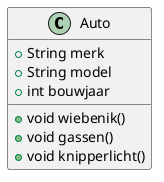
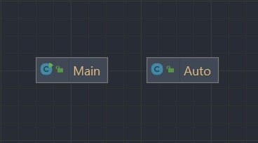

# Week 2

In week 2 begonnen we met Object-georiënteerd programmeren.
De eerste opdracht was om een [Auto klasse](Auto.java) te maken, en hem variabelen en methodes te geven.


```java
public class Auto{
    public String merk;
    public String model;
    public int bouwjaar;

    public void wiebenik() {
        System.out.printf("Mijn merk: %s \nMijn model: %s \nMijn bouwjaar: %d\n\n", merk, model, bouwjaar);
    }

    public void gassen() {
        System.out.println("Vroommmm!");
    }
    public void knipperlicht() {
        System.out.println("Knipper");
    }
}
```

Hieronder zie je het UML en het IntelliJ diagram:





Een belangrijk verschil tussen de twee is dat je in UML wel alle eigenschappen kan verwerken, maar in IntelliJ diagrams niet.
