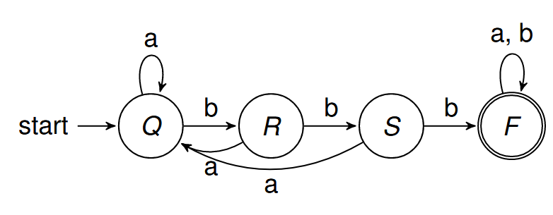
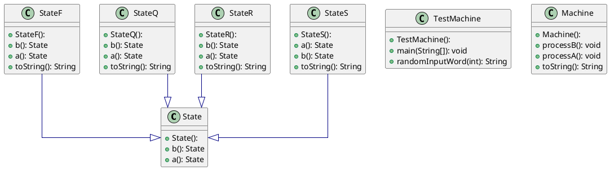
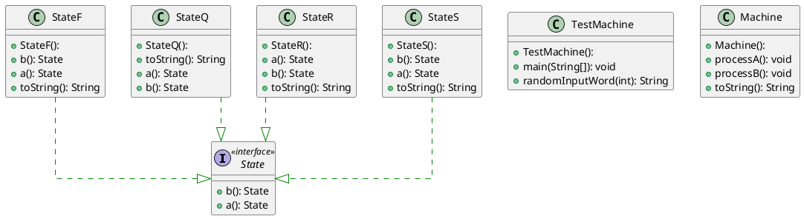
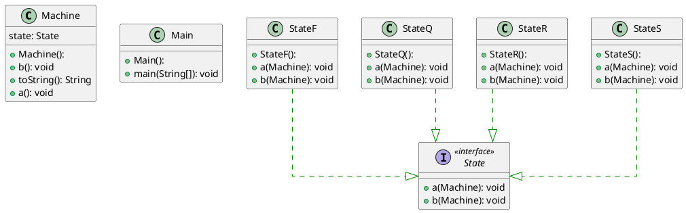
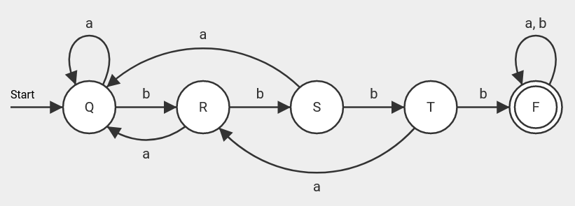
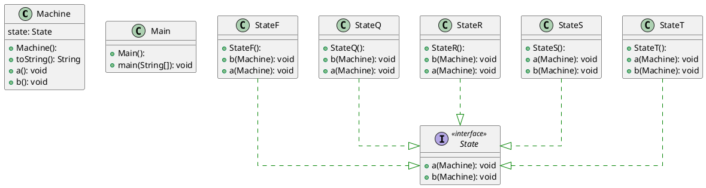

# Dit is de readme voor week 4

In week 4 heb ik 2 verschillende soorten implementaties van het state design pattern gedaan.
Het state diagram ziet er als volgt uit:



## State Machine type 1

Het eerste type wat ik heb gemaakt, creëert met elke nieuwe staat een nieuw object.
Ik heb ook deze 2 keer gemaakt; een keer met een superklasse, en een keer met een interface.

[Hier](./stateMachine1superclass) een link naar de implementatie met superklasse.  
[Hier](./stateMachine1interface) een link naar de implementatie met interface.

Met superklasse ziet het het UML diagram er zo uit:



Met interface ziet het UML-diagram er zo uit:



Beide machine's geven bij elke overgang een nieuw object `State` terug.
Afhankelijk van de huidige staat zal er dus een nieuw object `StateQ`, `StateR`, `StateS` of `StateF` aangemaakt worden.
Door `currentstate.a()` of `currentstate.b()` aan te roepen binnen de `processA` en `processB` functies varanderd dus de staat.

## State Machine type 2

Het tweede soort state machine werkt door eerst 4 states aan te maken, en naar een van die 4 te wisselen.
De functie `setState()` veranderd de staat van de machine in een van de klasses.
De functies `a()` en `b()` in de State classes, waaraan de machine als argument wordt gegeven, gebruiken de setState functie.
Omdat de machine klasse meegegeven wordt aan de functie, kan je bij de aangemaakte objecten in de Machine klasse.
Zo kun je per state aangeven naar welke staat een transitie staat.

[Hier](./stateMachine2) een link naar de 2e implementatie.



De methode `randomInputWord()` genereert een string van random characters.
```java
public class Main {
    public static String randomInputWord(int numOfUniqueChars) {
        // Random length
        int length = (int) (Math.random() * (MAXIMUM_WORD_LENGTH - MINIMUM_WORD_LENGTH) + MINIMUM_WORD_LENGTH);

        StringBuilder returnWord = new StringBuilder();

        // Generate random chars
        for (int i = 0; i < length; i++) {
            int charOffset = (int) (Math.random() * numOfUniqueChars);
            //System.out.printf("%c", ('a'+ charOffset));
            returnWord.append((char) ('a' + charOffset));
        }

        return returnWord.toString();
    }
}
```

De methode `executeMachine()` voert het willekeurige woord uit.
De methode neem als arguments:
- Machine die uitgevoerd moet worden
- Woord wat uigevoerd moet worden

Met een switch statement wordt elke transitie uitgevoerd

```java
public class Main {
    public static void executeMachine(Machine machine, String inputword) {
        int sizeOfWord = inputword.length();
        for (int i = 0; i < sizeOfWord; i++) {
            switch (inputword.charAt(i)) {
                case 'a':
                    machine.a();
                    break;
                case 'b':
                    machine.b();
                    break;
                default:
                    break;
            }
            System.out.println(machine);
        }
    }
}
```

De laatste opdracht was om een staat T erbij te maken.
Om dit uit te voeren moet een nieuwe klasse StateT aangemaakt worden.
Ik heb deze uitbreiding gedaan op de 2e implementatie van het state pattern.  
[Hier](./stateMachine2ExtraState) een link naar de map.

Ik heb de volgende uitbreiding bedacht:



Het UML diagram ziet er nu zo uit:

