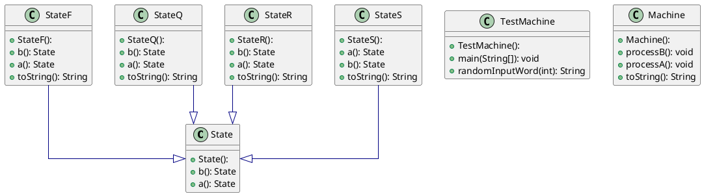
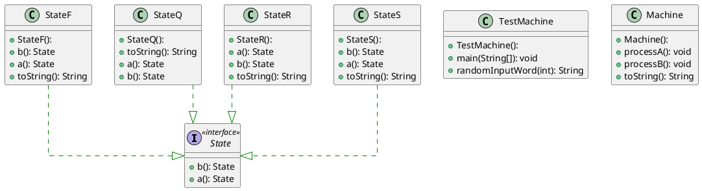

# Dit is de readme voor week 4

In week 4 heb ik 2 verschillende soorten implementaties van het state design pattern gedaan.
Het state diagram ziet er als volgt uit:

## State Machine type 1

Het eerste type wat ik heb gemaakt, creëert met elke nieuwe staat een nieuw object.
Ik heb ook deze 2 keer gemaakt; een keer met een superklasse, en een keer met een interface.

Met superklasse ziet het het UML diagram er zo uit:

Met interface ziet het UML diagram er zo uit:

Beide machine's geven bij elke overgang een nieuw object `State` terug.
Afhankelijk van de huidige staat zal er dus een nieuw object `StateQ`, `StateR`, `StateS` of `StateF` aangemaakt worden.
Door `currentstate.a()` of `currentstate.b()` aan te roepen binnen de `processA` en `processB` functies varanderd dus de staat.
