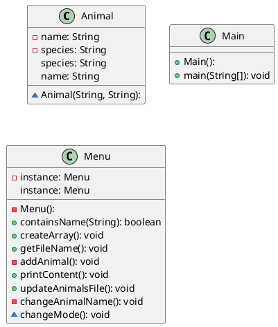

# Dit is de readme voor week 5

De eerste opdracht van week 5 was om een command line programma te maken dat een gebruiker huisdieren laat toevoegen/editen in en file.
Het programma moet eerst huisdieren uitlezen uit een file, en die in Animal objecten zetten.
Vervolgens moet de gebruiker ook dieren kunnen toevoegen en wijzigen.
De objecten voor de huisdieren moeten opgeslagen worden in een ArrayList.

### Lezen uit een file

Met de methode `getFileName()` wordt om een filenaam gevraagd.
Hiervan wordt een File object aangemaakt.

Met de methode `createArray()` worden de huisdieren uit de file [animals.txt](animals.txt) voor het eerst uigelezen uit de file.
Hiervan worden objecten gamaakt, die dan in een ArrayList gezet worden.
De soort en naam van een dier worden door ` - ` onderscheiden.
Op deze manier kun je met de `split()` methode een string array maken met de naam en soort apart.
De items in deze array worden dan gebruikt om een nieuw object aan te maken.

### Dier toevoegen

Met de methode `addAnimal()` kun je dieren toevoegen.
Er wordt met een scanner om een naam en soort gevraagd, die gebruikt worden om een nieuw object aan te maken en toe te voegen.

### Dier wijzigen

Met de methode `changeAnimalData()` kun je de naam van een dier wijzigen.
In deze methode wordt `updateAnimalsFile()` aangeroepen om de veranderingen weg te schrijven naar de text file.

### Singleton design pattern toepassen

Het singleton design pattern toepassen is geen goed idee voor de Animal klasse.
Je moet meerdere huisdier-objecten aanmaken, en dat maakt het singleton pattern onmogelijk.

